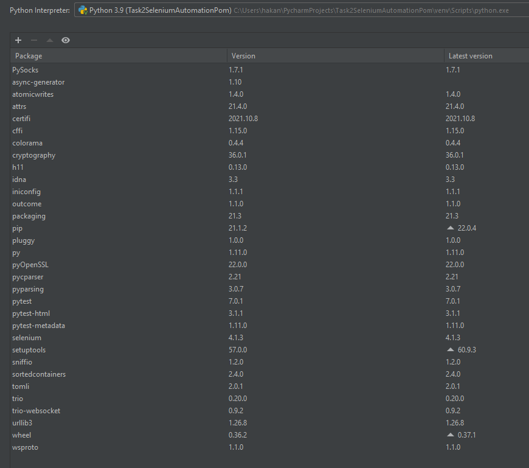

# TakeHomeTask - Hakan Özcan

## Task 1 Exploratory Test Charter

### I used xray https://www.getxray.app/exploratory-testing application for my exploratory test session. 

### You can find my Test Charter: /TakeHomeTask-M.HakanOzcan/Task1ExploratoryTestCharter.pdf

## Task 2 UI Test Automation with Selenium (POM)

### I used Page Object Model in Selenium. It helps make the code more readable, maintainable, and reusable.

### Language: Pyhon 3.9
### Chrome Driver Version: ChromeDriver 99.0.4844.51
### Chrome Version: Version 99.0.4844.51
### Packages: Selenium, Pytest, pip
### IDE: Pycharm

### How to run tests: pytest testCases/test_wiki.py

### Dont forget the change driver location "driver = webdriver.Chrome(executable_path = "C://browserdrivers//chromedriver.exe")" in conftest.py

## Test Scenerios

### 1. test_wikiPageTitle
It tests whether the given url is a wiki search page with the correct header.

### 2. test_clickSearch
It tests and checks the data entry to the search bar, whether the search button works and the search results page is related to the searched word.

### 3. test_advanceSearchBar
It tests to Advance Search Screen visibility

### 4. test_searchInBar
It tests to Search In Screen visibility

### 5. test_advanceSearhBarFields
It tests data entry to fields of Advance Search Screen also tests and checks the warning message that appears at the end of the search.

### 6. test_searchInBarFields
It tests and checks check boxes of SearchIn Screen.

### 7. test_SearchWithEnterButton
It tests and checks the data entry to the search bar, whether search with enter button and the search results page is related to the searched word.

## Task 3 API Test Automotion with Rest Assured

### I created Maven Project in the Intelij and ı used Rest Assured for the api automation. It has very efficient to asserting expected results.

### JDK Version 17.0.2
### Dependencies: Rest Assured, testng, slf4j
### IDE: Intelij

## Test Scenerios

### 1. test_UserLogout
GET https://petstore.swagger.io/v2/user/logout It tests the status code and whether it contains an "ok" message.

### 2. test_FindByStatusSold
GET https://petstore.swagger.io/v2/pet/findByStatus?status=sold It tests the status code and response time.

### 3. test_NonexistentID

GET https://petstore.swagger.io/v2/pet/{1994} It tests the status code and response time.

### 4. test_AddANewPet

POST https://petstore.swagger.io/v2/pet  It tests the status code and response time and also tests and checks the "name" in the body.

### 5. testStoreOrder

POST https://petstore.swagger.io/v2/store/order It tests the status code and response time and also tests and checks the "status" and "complete" in the body.
